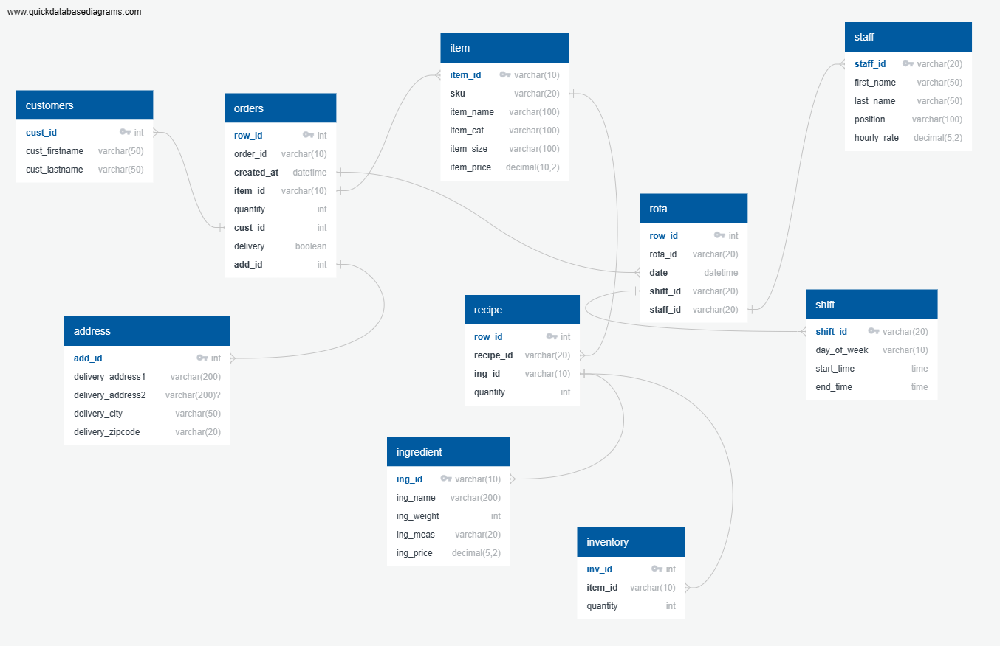

# Pizzeria Project

This project aims to design and build a custom relational database for a new pizzeria. The focus will be on the backend part, while the frontend order system will be developed by another team.

## Project Description
The pizzeria will be a take-out and delivery-only establishment, without dine-in service. The client, Ben, wants to have a database that can capture and store all the important information generated by the business, with the goal of monitoring the performance of the business through a control panel.
 
The project will be divided into three main areas of concentration:

1. Customer Orders
2. Inventory Control
3. Employee Data

## Customer Orders
Customer orders will be the foundation of the system. Ben provided an initial list of data he wants to collect for each order:

- Item name
- Item price
- Quantity
- Customer name
- Delivery address
 
Based on this information, we identified the need to include additional fields such as Order ID, item size, and product category (pizza, side dish, dessert, beverage). The delivery address will also be divided into different parts, such as address line 1, address line 2, city, and postal code.

## Inventory Control
Inventory control is essential to ensure proper supply of ingredients. Ben wants to efficiently monitor the inventory, identifying when it is necessary to place new orders. For this purpose, information will be collected on the ingredients used in each pizza, their quantities based on pizza size, and the current inventory level.
  
To simplify the project, it is assumed that all suppliers have the same delivery lead time for items. Based on the information provided by Ben about the ingredients for each pizza, including weights and required quantities, separate tables were created for ingredients and recipes, allowing for accurate calculation of the cost of each pizza.

## Employee Data
Ben would also like to have access to employee data and their work schedules. This includes information such as salaries, start and end times. These data will be added to the database and will allow for the calculation of labor costs.

## Tools
To design the database, the Quick Database Diagrams (Quick DBD) tool was used, which allowed visualizing and defining tables, their fields, and relationships. Subsequently, the resulting diagram was exported to a SQL database management software (PostgreSQL). 

*diagram*

## Database
After creating the tables, CSV files containing the information for each table were imported.
 
Queries were built to help us construct the control panel.

### Query 1 - Order Activity

Query for Control Panel 1 - Order Activity
For this panel, we need the following data:

- Total orders
- Total sales
- Total sales
- Average order value
- Sales by category
- Best-selling items
- Orders by hour
- Sales by hour
- Orders by address
- Delivery or pickup orders

### Query 2 - Inventory Management
Aqui está o que precisamos:

- Total quantity per ingredient
- Total ingredient cost
- Calculated pizza cost
- Remaining stock percentage per ingredient

 
To obtain this information, two SQL queries were used. The first query calculates the cost of ingredients for each item sold. The second query relates the ingredients to the current stock.

 
Another query related to employee data was created to calculate the cost of the team based on the work schedule information. 
 
These queries are used to extract the necessary data from the related tables, and then the data can be used to build the desired control panels.

## Dashboards 

The dashboards were developted in PowerBI. You can view the dashboard [here](dashboard.pdf).

## Conclusion
The project to build the database for the pizzeria aims to meet the needs of Ben, the client, by providing an efficient solution to store and analyze business data. With proper collection and organization of this information, it will be possible to monitor business performance, manage inventory more efficiently, and analyze labor costs, providing a solid foundation for strategic decision-making.

